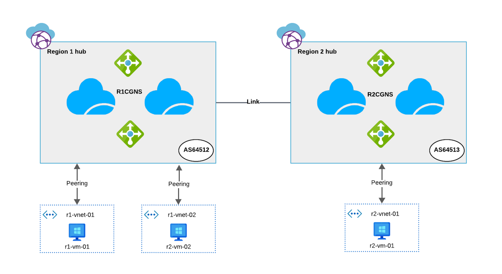
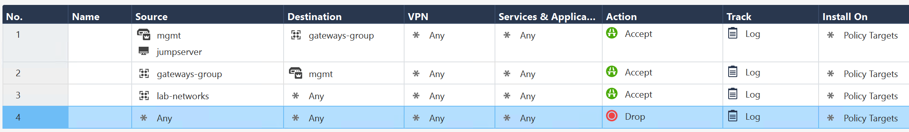
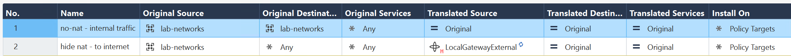

# [DRAFT] Check Point CloudGuard Network Security for Virtual WAN Demo Lab

This repository offers Terraform templates to deploy a complete demo lab for Check Point CloudGuard Network Security (CGNS) within an Azure Virtual WAN environment. Designed for modularity and scalability, this lab enables you to deploy a full working lab with dedicated networking resources perfect for testing and demos.

Virtual WAN setups can be time-consuming and costly to maintain. This lab accelerates deployment by using terraform to deploy Virtual WAN hubs, test servers, and CGNS for Virtual WAN, so you can dive into testing and showcasing capabilities without the setup hassle.

---

## Lab Overview

This lab will deploy the following: 

- **2 x Virtual WAN Hubs:** One hub in Region 1 and another in Region 2.
- **Test Servers:** Each hub will have a connected spoke with an Ubuntu test server for traffic and performance testing.
- **CloudGuard Network Security (CGNS):** CGNS will be deployed in both hubs.

---

## Lab Diagram



---

## Prerequisites

You will need the following before deploying the lab:

- **Terraform:** Install from [Terraform Download](https://www.terraform.io/downloads.html).
- **Azure CLI:** Install from [Azure CLI installation](https://docs.microsoft.com/en-us/cli/azure/install-azure-cli).
- **Azure Subscription Details:** Required subscription and credential details for the deployment.
  ```
  subscription_id      = "xxx-xxx-xxx"
  tenant_id            = "xxx-xxx-xxx"
  client_id            = "xxx-xxx-xxx"
  client_secret        = "xxx-xxx-xxx
  ```
- **Azure CLI Login:** Login to Azure CLI
  ```bash
    az login --service-principal -u <client-id> -p <client-secret> --tenant <tenant-id>
  ```
- **SSH Public Key:** Use an existing SSH key or generate a new one if needed.
  ```bash
  ssh-keygen -t rsa -b 4096
  ```

---

## Lab Instructions

1. **Transfer Terraform Files:**

   - Clone or download the repository and transfer the files to your working directory.

2. **Update `lab.txt` file with the required details**


    ```plaintext
    //********************** Required Fields **************************//

    subscription_id      = "xxx-xxx-xxx"
    tenant_id            = "xxx-xxx-xxx"
    client_id            = "xxx-xxx-xxx"
    # client_secret      = "Enter during terraform apply or define here" 
    
    allowed_ssh_ips      = ["<your IP address>", "10.0.0.0/8", "172.16.0.0/12", "192.168.0.0/16"]

    route_to_internet_ips = "<your IP address>"
    vm_admin_username     = "john"
    vm_ssh_key            = "ssh-rsa xxxxx"
    ```

3. **Initialize Terraform:**

   ```bash
   terraform init
   ```

4. **Deploy Virtual WAN Hubs and Test Ubuntu NVAs:**

   ```bash
   terraform apply -var-file="lab.txt" \
     -target=module.virtual_wan_hub \
     -target=module.ubuntu_nvas \
     -target=module.vnet_hub_connection
   ```

    - Enter client_secret at the prompt 

5. **Deploy CGNS for vWAN:**

   ```bash
   terraform apply -var-file="lab.txt" \
     -target=module.r1_cgns \
     -target=module.r2_cgns
   ```

    - Enter client_secret at the prompt 

6. **Connect CGNS NVAs to Security Management Server**

  - Refer to the [CloudGuard Network for Azure Virtual WAN Deployment Guide](https://sc1.checkpoint.com/documents/IaaS/WebAdminGuides/EN/CP_CloudGuard_Network_for_Azure_vWAN/Content/Topics-Azure-vWAN/Deploying-New-CGNS-NVA.htm?TocPath=Integrating%20CloudGuard%20Network%20Security%20NVA%20with%20Azure%20Virtual%20WAN%7CStep%204%3A%20Connect%20to%20Check%20Point%20Security%20Management%20Server%20or%20Quantum%20Smart-1%20Cloud%20(Management-as-a-Service)%7C_____0#Step_4__Connect_to_Check_Point_Security_Management_Server_or_Quantum_Smart-1_Cloud):

    - **Connect to Check Point Security Management Server or Quantum Smart-1 Cloud (Management-as-a-Service)** 
    - **Configuring the NVA in the Security Management Server.**

7. **Define access control and NAT rules** 

  - **Access Control** 

  

  - **NAT Rules** 

  

  - **Install Security Policy** 

8. **Set Routing Intent**

    - Refer to the [CloudGuard Network for Azure Virtual WAN Deployment Guide](https://sc1.checkpoint.com/documents/IaaS/WebAdminGuides/EN/CP_CloudGuard_Network_for_Azure_vWAN/Content/Topics-Azure-vWAN/Deploying-New-CGNS-NVA.htm?TocPath=Integrating%20CloudGuard%20Network%20Security%20NVA%20with%20Azure%20Virtual%20WAN%7CStep%204%3A%20Connect%20to%20Check%20Point%20Security%20Management%20Server%20or%20Quantum%20Smart-1%20Cloud%20(Management-as-a-Service)%7C_____0#Step_6__Set_Routing_Intent_and_Routing_Policies) for detailed steps:


    By now you should have a fully functioning Azure Virtual WAN Lab with CloudGuard Network Security installed

## Test Scenarios

  This section outlines various test scenarios to validate connectivity and traffic flow across different regions and configurations.

- **East <-> West**  
    - `r1-vm-01` <-> `r1-vm-02` (Ping/tcp 22)

- **South <-> North traffic flow**  
    - `r1-vm-01` -> Internet (Ping/tcp 80)

- **North <-> South**  
    - Internet -> `r1-vm-01` (Ping/tcp 22)  
    - Refer to [Configuring Ingress Traffic](https://sc1.checkpoint.com/documents/IaaS/WebAdminGuides/EN/CP_CloudGuard_Network_for_Azure_vWAN/Content/Topics-Azure-vWAN/Deploying-New-CGNS-NVA.htm?TocPath=Integrating%20CloudGuard%20Network%20Security%20NVA%20with%20Azure%20Virtual%20WAN%7CStep%204%3A%20Connect%20to%20Check%20Point%20Security%20Management%20Server%20or%20Quantum%20Smart-1%20Cloud%20(Management-as-a-Service)%7C_____0#Step_8__Configuring_Ingress_traffic) for instructions on configuring ingress traffic.

- **Cross-Region**  
    - `r1-vm-01` <-> `r2-vm-01` (tcp 22)

- **Traffic Performance Testing**  
    
    Run network performance test using iperf between 
    - `r1-vm-01` <-> `r1-vm-02` (tcp 5201)

    This command will initiate a traffic test between r1-vm-01 and r1-vm-02

    - On r1-vm-01 (client)
    ```bash
    r1-vm-01# iperf3 -c "10.10.2.4 [r1-vm-02-ip]" -P 2 -R -t 600
    ```

    - On r1-vm-02 (server)
    ```bash
    r1-vm-02# iperf3 -s
    ```

---

## Accessing Test Servers

- SSH into the test servers using their public IP addresses and your SSH key:

  ```bash
  ssh -i <your_private_key> <vm_admin_username>@<ubuntu test nva public_ip>
  ```

- Ensure your IP is defined in the allowed_ssh_ips section in the lab.txt file to maintain connectivity to ubuntu test nvas. (Your IP will be the only one routed directly to the internet, bypassing the internet routing intent.)

---

## Accessing CGNS for VWAN

- SSH into CGNS NVAs via their public IP addresses and your SSH key:

  ```bash
  ssh -i <your_private_key> admin@<public_ip>
  ```

## Expanding Test Machines and Customizing NVAs

- **Add More Test Machines**: You can expand the number of test machines in each region by adding additional subnets to `r1_nva_subnets` or `r2_nva_subnets` in `lab.txt`. Each new subnet will deploy an additional Ubuntu Network Virtual Appliance (NVA) in that region.

    **Example**:  
    ```plaintext
    r1_nva_subnets = ["10.10.1.0/24", "10.10.2.0/24", "10.10.3.0/24"]
    ```
    This configuration will create three test NVAs in Region 1. To apply these changes, simply run `terraform apply` from Step 4.

- **Custom Package Installation**: You can specify custom packages to install on each Ubuntu NVA by modifying the `cloud-init.sh` file in the module. Any packages or configurations added to `cloud-init.sh` will be applied automatically to all deployed NVAs.

## Lab Teardown Instructions

To remove the lab, follow these steps:

1. **Step 1: Remove CGNS Modules:**

   ```bash
   terraform destroy -var-file="lab.txt" \
     -target=module.r1_cgns \
     -target=module.r2_cgns
   ```

2. **Step 2: Remove vWAN and Ubuntu Instances:**

   ```bash
   terraform destroy -var-file="lab.txt" \
     -target=module.virtual_wan_hub \
     -target=module.ubuntu_nvas \
     -target=module.vnet_hub_connection
   ```

---

## How to Contribute

1. Fork the repository.
2. Create a new branch for your feature or bug fix.
3. Commit your changes.
4. Submit a pull request for review.
